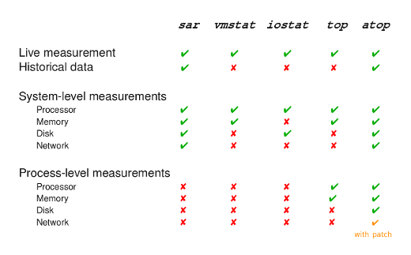

# Description: The atop Command

The process level network analysis can be done using the netatop kernel module.

### Notes
* The atop is an open source tool to monitor system and processes and log its history.
* Install atop using the command `sudo apt-get install atop`.
* The default configuration file is available on the path `/etc/default/atop`.
* The default log file is available on the path `/var/log/atop/atop_YYYYMMDD`.
* Stop atop accounting by sending kill -15. Never shutdown atop using kill -9 because system accounting files
  will continue to grow.

### Uses of atop Analysis
* Interactive use: Bad response times (seconds).
* Batch processing: Throughput (transactions/second).
* Structural issues like system ALWAYS slow.
* Incidental issues like system SOMETIME slow .
* Analysis of historical data.

### Atop Vs Peer Comparison


### Rule of Thumb for Hardware Resources Overload 
* Processor(s)          : Less than 80% per CPU.
* Memory                : Limited swapout (preferably none).
* Disk(s)               : Less than 65% per disk.
* Network Interface(s)  : [TODO]

### Advantages of atop
* The atop stays active in the background for long-term server analysis which is up to 28 days by default.
* The atop daemon writes snapshots to a compressed log file which can be read using atop or atopsar command.
* The atop shows resource usage of ALL processes, even those that are closed/completed.
* The atop monitors threads within processes & ignores processes that are unused.
* The atop accumulates resource usage for all processes and users with the same name.
* The atop highlights critical resources using colors (red).
* The atop will add or remove columns as the size of the display window changes.
* The atop can monitor disk I/O and network utilization also.
* The atop uses netatop kernel module to monitor TCP & UDP and network bandwidth. 

### Sorting atop Output
Once atop is running, either live or the log files, use the following shortcut keys to sort processes.
* c - Sort by cpu consumption (default).
* a - Sort in order of most active resource.
* d - Sort in order of disk activity.
* m - Sort in order of memory usage
* n - Sort in order of network activity

### Navigate atop Log Files
* t - Go forward in 10 minute intervals.
* T - Go backward in 10 minute intervals.
* b - Go to a snapshop at a particular time. Enter the time in format hh:mm after pressing b.

### Setup custom Interval for atop
* Edit the file `/etc/default/atop` and update the default value for `INTERVAL=60` to `INTERVAL=30` and restart service.

### Common Examples
```shell
sudo atop
sudo atop -r /var/log/atop/atop_20170829
sudo systemctl restart atop.service
```

### Examples With Details
```shell
systemctl restart atop.service          # Restart atop service after editing the config file /etc/default/atop.
atop -r /var/log/atop/atop_20170829     # Read atop compressed and binary log files.

atop -a                                 # Display active processes only.
atop -y                                 # Display individual threads.
atop -1                                 # Display average-per-second total values.
atop -m                                 # Display memory related process info.
atop -d                                 # Display disk related process info.
atop -n                                 # Display network related process info. This requires plugin.
atop -s                                 # Display scheduling related process info.
atop -v                                 # Display various process info like ppid, user/group, date/time.
atop -c                                 # Display command line per process.

man atop                                # Read the man pages.
atop -h                                 # Get atop help.
```

### Cool Tricks
* None

### TODO
* None
